# Moss Side Volleyball Club 

**Developer: Aleksandra Haniok**

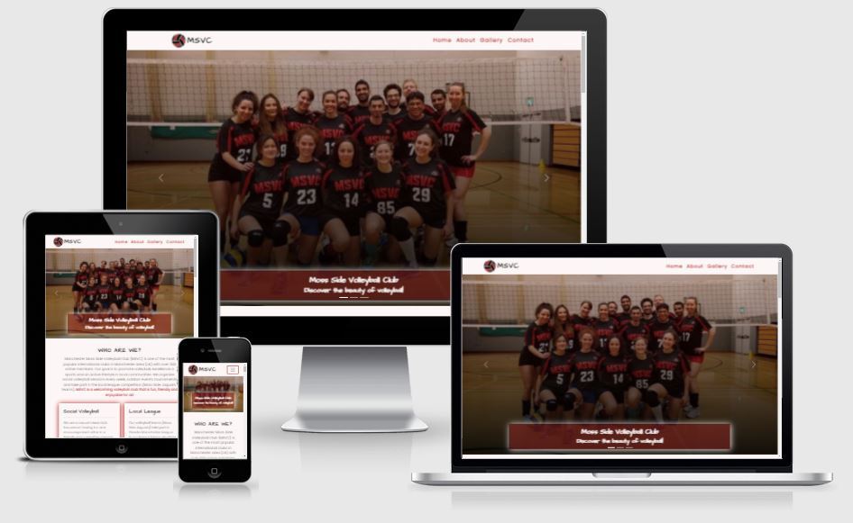

[Live website](https://aleksandracodes.github.io/CI_PP1_MSVC/)

## Table of Content

  - [Project Goals](#project-goals)
    - [User Goals](#user-goals)
    - [Site Owner Goals](#site-owner-goals)
  - [User Experience](#user-experience)
    - [Target Audience](#target-audience)
    - [User Requirements and Expectations](#user-requirements-and-expectations)
    - [User Stories](#user-stories)
  - [Design](#design)
    - [Colour](#colour)
    - [Fonts](#fonts)
    - [Structure](#structure)
    - [Wireframes](#wireframes)
  - [Technologies Used](#technologies-used)
    - [Languages](#languages)
    - [Frameworks, Libraries & Tools](#frameworks-libraries--tools)
  - [Features](#features)
  - [Validation](#validation)
    - [HTML Validation](#html-validation)
    - [CSS Validation](#css-validation)
  - [Testing](#testing)
    - [Accessibility](#accessibility)
    - [Performance](#performance)
    - [Performing tests on various devices](#performing-tests-on-various-devices)
    - [Browser compatability](#browser-compatability)
    - [Testing user stories](#testing-user-stories)
  - [Bugs](#bugs)
  - [Deployment](#deployment)
  - [Credits](#credits)
  - [Acknowledgements](#acknowledgements)

## Project Goals

### User Goals

- Find a local volleyball club that offers training sessions for beginners where you can learn basic volleyball skills
- See the timetable of volleyball sessions
- Find a local team to compete in the volleyball league
- Find the location of sports venues where training sessions take place
- Enquire more information about the trainings and club
- Express interest and joining local community in playing volleyball

### Site Owner Goals

- Promote volleyball in the local area
- Promote the club
- Encourage people to start playing volleyball
- Provide essential information about the training sessions
- Obtain new players to the competitive team

## User Experience

### Target Audience

- People looking to learn to play volleyball
- People looking to come back to volleyball after not playing for a long time
- People willing to find a club which takes part in the local competition

### User Requirements and Expectations

- Quickly and easily find the relevant information
- Simple navigation around website
- Visually appealing design for all screen size
- Links and functions that work as expected
- An easy way to contact the club
- Accessibility

### User Stories

#### First-time users

1. As a first time user, I want to find out more about the club
2. As a first time user, I want to find out if I can join the club if I have never played volleyball before
3. As a first time user, I want to know if the club takes part in the local competition
4. As a first time user, I want to get a feeling of the club
5. As a first time user, I want to be able to contact the club with a specific question
   
#### Returning visitor

1. As a returning user, I want to see pictures from the club tournaments
2. As a returning user, I want to know who joins the social sessions
3. As a returning user, I want to find the club on social media
4. As a returning user, I want to know the training sessions times
5.  As a returning user, I want to get direction to the sports venues

#### Site Owner

11.	As the site owner, I want user to get to know the club
12.	As the site owner, I want user to be able to contact us
13.	As the site owner, I want users to join the training sessions
14.	As the site owner, I want my site to be responsive
15.	As the site owner, I don’t want users to use browser back button if they’re searching for a page which does not exist.

## Design

### Colour

For the colour scheme a combination of black, dark red and white were chosen to match the club's logos. These colours and their shades were used throughout each section in such a way to ensure the contrast between them was right.

### Fonts

Architects Daughter with cursive as fallback was used for the logo and headings to give a bit of fun and relax feeling of the club.
Poppins with sans-serif as fallback was used for the body to present the content in clear and legible way.

### Structure

The website is structured in a user friendly and easy to learn way. At the top of the page the user can see a recognisable type of navigation bar with the club logo and name on the left side and the navigation links to the right which collapse to hamburger icon on smaller screen sizes. 

The website consists of four sections:

- A landing (home) section with a navigation bar and hero images on a carousel
- An about section with the information about the club
- A gallery with images from social volleyball trainings and local league games giving a general feel of the club
- A contact section with a contact form, location maps of two sports venues and information how to find the club

At the bottom of the page there is a footer with links to social media and copyrights info.

A separate 404 error page was created.

### Wireframes

Big screens - laptop & desktop

Medium screens - tablets

Small screens - mobile

## Technologies Used

### Languages

- HTML
- CSS

### Frameworks, Libraries & Tools

- [Am I Responsive](http://ami.responsivedesign.is/) was used to create the multi-device mock-up you can see at the start of this README.md file.
- [Balsamiq](https://balsamiq.com/) to create the projects wireframes
- [Bootstrap v5.1.3](https://getbootstrap.com/)
- [Favicon.io](https://favicon.io) for making the site favicon
- [Font Awesome](https://fontawesome.com/) - Icons from Font Awesome were used throughout the site.
- [Git](https://git-scm.com/) was used for version control within VSCode to push the code to GitHub.
- [GitHub](https://github.com/) was used as a remote repository to store project code.
- [Google Fonts](https://fonts.google.com/)
- [Google Maps](https://www.google.com/maps) were used to create the embedded map with location pins
- [Pixabay.com](Pixabay.com) was used for pictures
- [Remove.bg](https://www.remove.bg/) was used to remove background on logos
- [WC3 Validator](https://validator.w3.org/), [Jigsaw W3 Validator](https://jigsaw.w3.org/css-validator/), [Wave Validator](https://wave.webaim.org/), [Lighthouse](https://developers.google.com/web/tools/lighthouse/) and [Am I Responsive](http://ami.responsivedesign.is/) were all used to test the website
  
## Features

The website consists of four sections and ten features.

### Logo and Navigation Bar
- Featured on the main website and the 404 error page
- The logo takes user to the main website home screen
- The nav bar contains links to Home screen (top of website), About section, Gallery section and Contact section.
- The nav bar is fully responsive and changes to a toggler (hamburger menu) on smaller size screens
- The navbar allows user to easily jump to a specific section on the website

### Carousel
- Created based on Bootstrap framework.
- User is presented with three pictures from the club which give them a friendly feeling of the club.
- The headings over the pictures are to make the user welcomed on the website and encourage them to join the club
- The pictures slide automatically but user has the option to change the pictures via back and forward arrows or indicators at the bottom

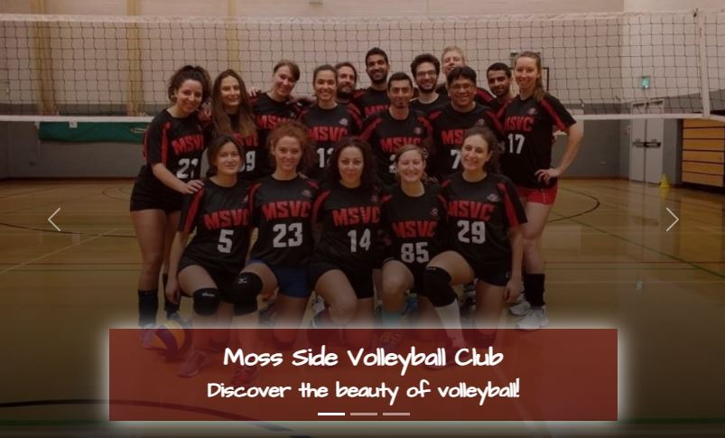

### About Section
- Provides a general description of the club
- Describes the social volleyball and local league competition
- Presents user with two club logos
- Provides information about training times, cost and locations
- User stories covered: 1, 2, 3, 7, 9, 11, 13

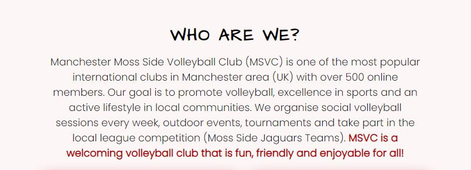
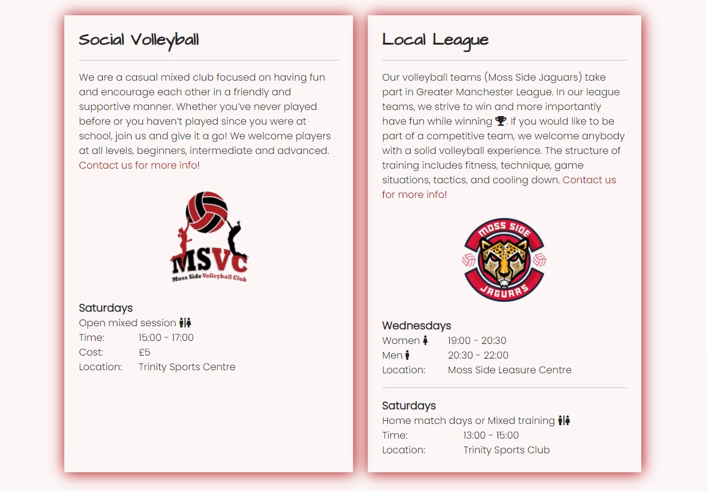

### Gallery Section
- Selection of images from social volleyball training and events
- Selection of images from local volleyball competition
- Each image slightly enlarges when hovered
- User stories covered: 4, 6, 7, 11

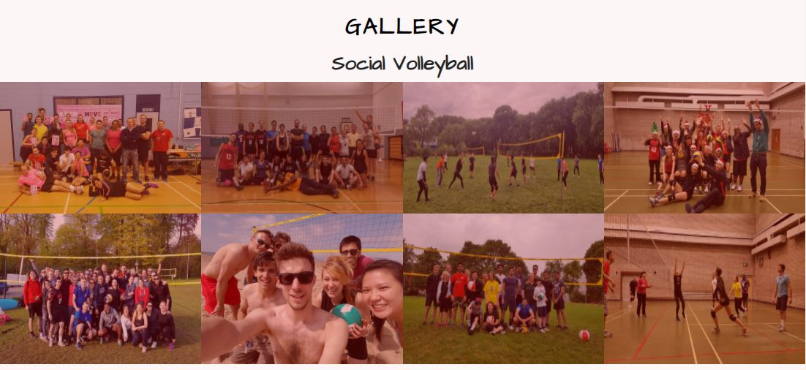
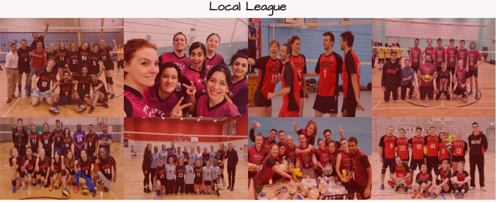

### Quote
- An insprational and motivational volleyball quote to intrigue users about this sport

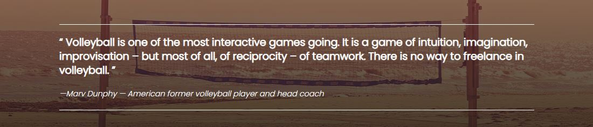

### Contact Form
- Enables user to contact the club with a specific question or express interest in joining the club.
- User stories covered: 2, 5, 12

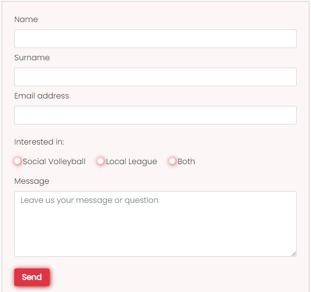

### Maps
- Provides user with directions to the sports venues
- User stories covered: 10

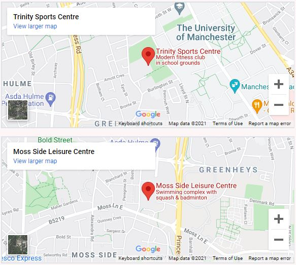

### Info
- Provides user with sports venues addresses and contact email
- User stories covered: 5, 10, 12
  
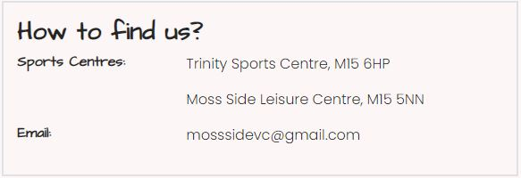

### Footer
- Featured on the main website and the 404 error page
- Contains links to social media, opening in a separate window
- Contains copyrights info
- User stories covered: 8

### 404 error page
- Displayed when a request triggers the HTTP 404 response code
- User does not have to use browser back button to go to the main website
- User stories covered: 15

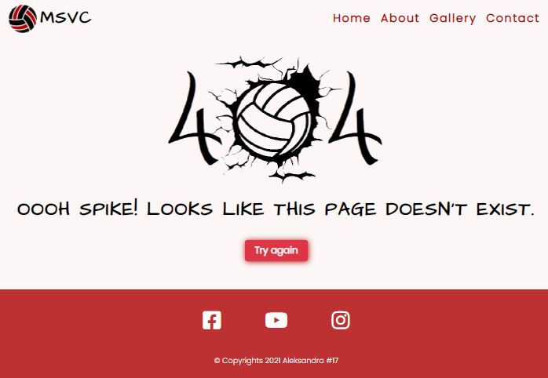

## Validation

### HTML Validation

The W3C Markup Validation Service was used to validate the HTML of the website. All pages pass with no errors or no warnings to show.

All site

404 error page

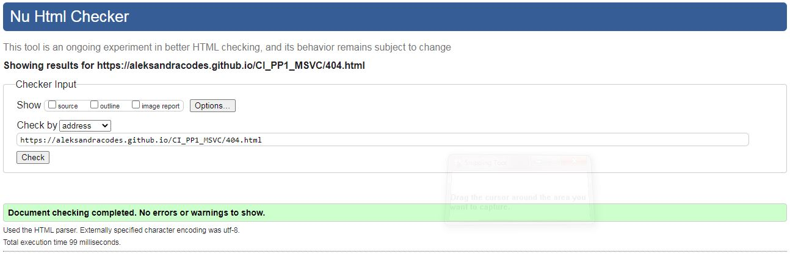

### CSS Validation

The W3C Jigsaw CSS Validation Service was used to validate the CSS of the website.
When validating all website, it passes with no errors found. However, some warning are identified linked to Bootstrap v5.1.3. 
When validating my own internal CSS, the validator shows no errors and one warning associated with vendor extension (-webkit-appearance).

All site

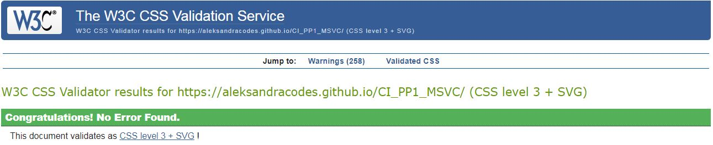
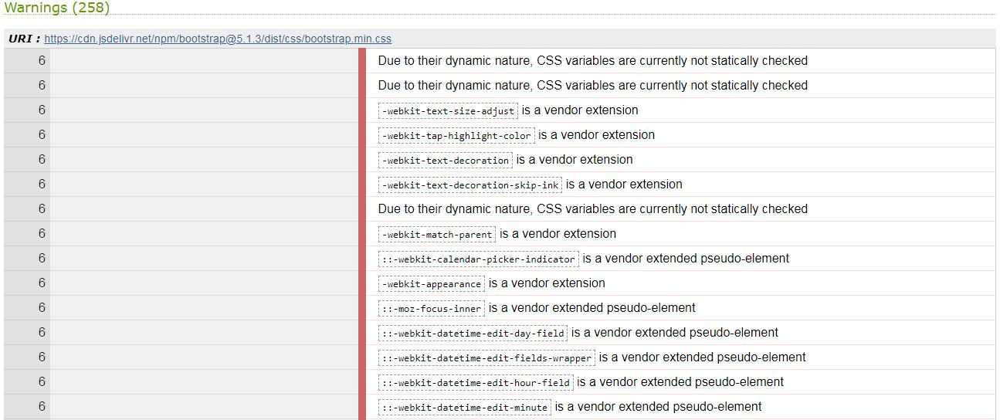

Style.css

## Testing

### Accessibility

The WAVE WebAIM web accessibility evaluation tool was used to ensure the website met high accessibility standards. All site pass with 0 errors.

See evaluation summary

### Performance

Google Lighthouse in Google Chrome Developer Tools was used to test the performance of the website.

See evaluation summary
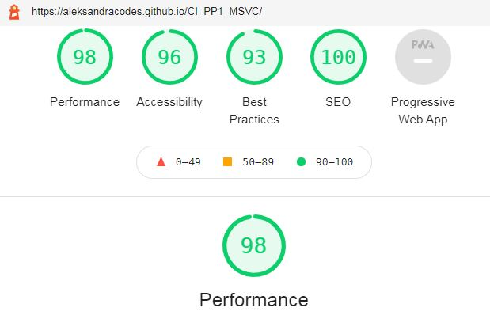

### Performing tests on various devices

The website was tested using Google Chrome Developer Tools Toggle Device Toolbar to simulate viewports of different devices. 

The website was tested on the following devices:
- Lenovo B590 (laptop screen size)
- Samsung Galaxy Tab A (tablet screen)
- Samsung S7 (mobile screen)

### Browser compatability

The website was tested on the following browsers:
- Google Chrome
- Mozilla Firefox

### Testing user stories

1. As a first time user, I want to find out more about the club
2. As a first time user, I want to find out if I can join the club if I have never played volleyball before.
3. As a first time user, I want to know if the club takes part in the local competition

| **Feature**   | **Action**                    | **Expected Result**           | **Actual Result** |
| ------------- | ----------------------------- | ----------------------------- | ----------------- |
| About section | Navigate to the About section | Find description of the club. | Works as expected |

| About section, Social Volleyball | Navigate to the About section | Description tells the user they can join with no previous experience | Works as expected |

| About Section, Local League | Navigate to the About section | User is provided with information about the MSVC League Teams, experience required and structure of trainings | Works as expected |

Screenshot

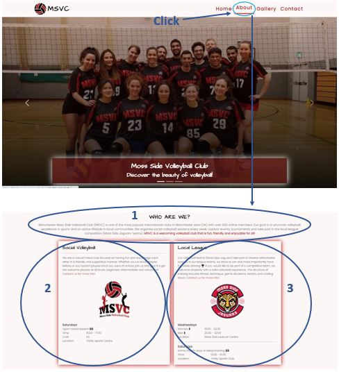

4. As a first time user, I want to get a feeling of the club

| **Feature**     | **Action**                      | **Expected Result**                                                    | **Actual Result** |
| --------------- | ------------------------------- | ---------------------------------------------------------------------- | ----------------- |
| Gallery section | Navigate to the Gallery section | View pictures of the social volleyball sessions and local league teams | Works as expected |

Screenshot

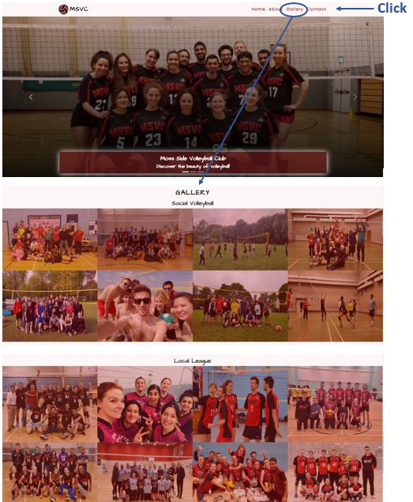

5. As a first time user, I want to be able to contact the club with a specific question

| **Feature**  | **Action**                                                        | **Expected Result**            | **Actual Result** |
| ------------ | ----------------------------------------------------------------- | ------------------------------ | ----------------- |
| Contact Form | Navigate to the Contact section, fill out and submit contact form | Data submited via contact form | Works as expected |

Screenshot

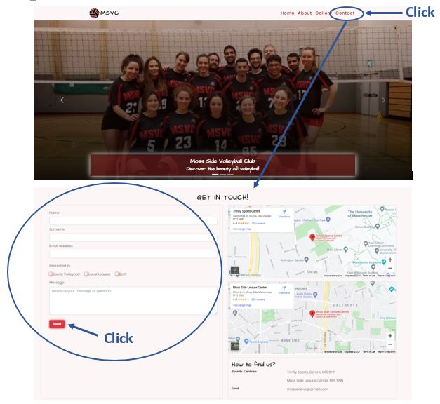

6. As a returning user, I want to see pictures from the club tournaments

| **Feature**     | **Action**                      | **Expected Result**                                                    | **Actual Result** |
| --------------- | ------------------------------- | ---------------------------------------------------------------------- | ----------------- |
| Gallery section | Navigate to the Gallery section | View pictures of the social volleyball sessions and local league teams | Works as expected |

Screenshot

7. As a returning user, I want to know who joins the social sessions

| **Feature**     | **Action**                      | **Expected Result**                                                | **Actual Result** |
| --------------- | ------------------------------- | ------------------------------------------------------------------ | ----------------- |
| About section   | Navigate to the About section   | See description of Social Volleyball                               | Works as expected |
| Gallery section | Navigate to the Gallery section | View pictures from the social volleyball trainings and tournaments | Works as expected |

Screenshots

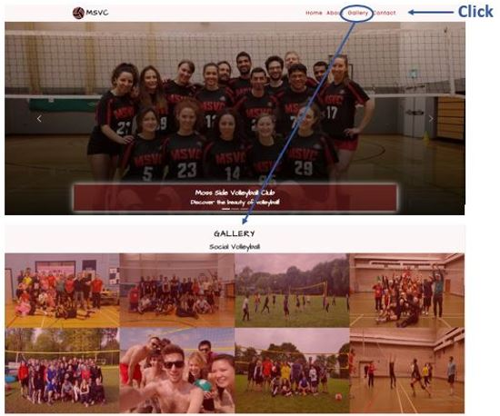

8. As a returning user, I want to find the club on social media

| **Feature**                    | **Action**                       | **Expected Result**         | **Actual Result** |
| ------------------------------ | -------------------------------- | --------------------------- | ----------------- |
| Footer with social media icons | Scroll to the bottom of the page | Click on social media links | Works as expected |

Screenshot

9. As a returning user, I want to know the training sessions times

| **Feature**   | **Action**                    | **Expected Result**                                  | **Actual Result** |
| ------------- | ----------------------------- | ---------------------------------------------------- | ----------------- |
| About section | Navigate to the About section | Find social volleyball & local league training times | Works as expected |

Screenshot

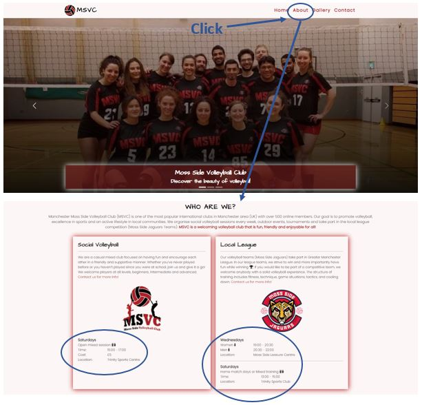

10. As a returning user, I want to get direction to the sports venues

| **Feature** | **Action**                                                                | **Expected Result**                               | **Actual Result** |
| ----------- | ------------------------------------------------------------------------- | ------------------------------------------------- | ----------------- |
| Maps        | Navigate to the Contact section, locate maps and click on directions link | See directions to the sports venues Goole Maps    | Works as expected |
| Info        | Navigate to the Contact section, locate info box                          | See adresses with post codes to two sports venues | Works as expected |

Screenshots

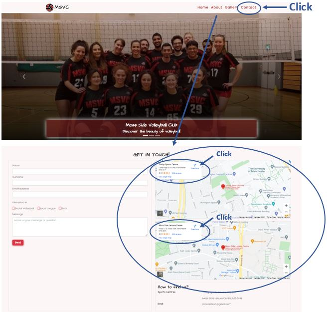
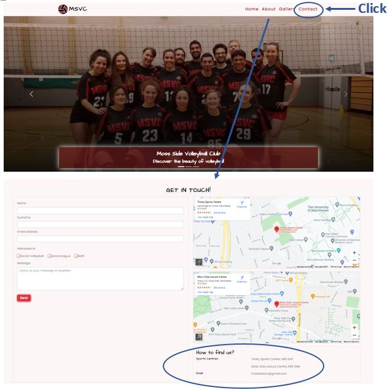

11. As the site owner, I want user to get to know the club

| **Feature** | **Action** | **Expected Result** | **Actual Result** |
| ----------- | ---------- | ------------------- | ----------------- |

| About section | Navigate to the About section | Find description of the club. | Works as expected |
| Gallery section | Navigate to the Gallery section | Users can view pictures of the social volleyball sessions and local league teams | Works as expected |

Screenshots

12. As the site owner, I want user to be able to contact us.

| **Feature**  | **Action**                                                                                    | **Expected Result**            | **Actual Result** |
| ------------ | --------------------------------------------------------------------------------------------- | ------------------------------ | ----------------- |
| Contact Form | Navigate to the Contact section and locate the contact form, fill out and submit contact form | Data submited via contact form | Works as expectd  |
| Info         | Navigate to Contact section and locate the How to find us box                                 | Find the contact email         | Works as expected |

Screenshots

13. As the site owner, I want users to join the training sessions

| **Feature**   | **Action**                    | **Expected Result**                                  | **Actual Result** |
| ------------- | ----------------------------- | ---------------------------------------------------- | ----------------- |
| About section | Navigate to the About section | Find social volleyball & local league training times | Works as expected |

Screenshot

14. As the site owner, I want my site to be responsive

Each section of the website was tested using Google Chrome Developer Tools Toggle Device Toolbar to simulate viewports of different devices. I can confirm the website is fully responsive.

Example screenshots

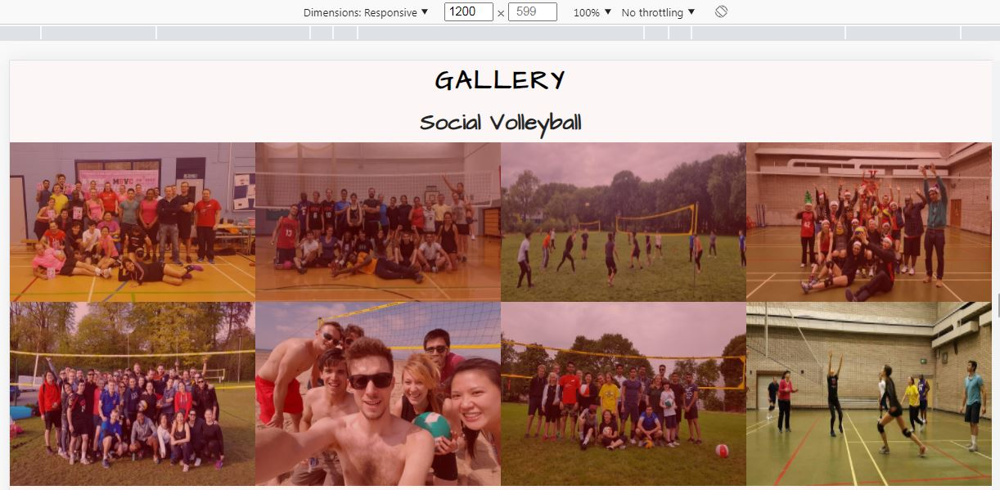
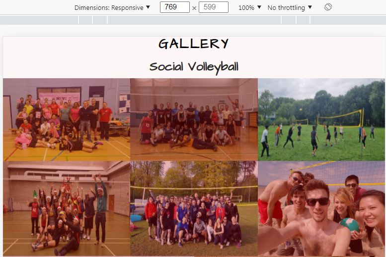
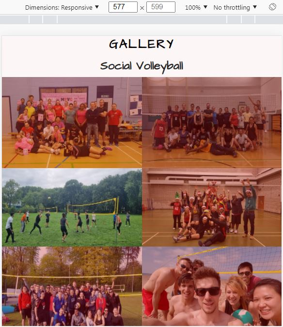
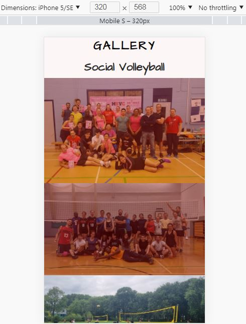

15. As the site owner, I don’t want users to use browser back button if they’re searching for a page which does not exist.

| **Feature**    | **Action**                                                              | **Expected Result**           | **Actual Result** |
| -------------- | ----------------------------------------------------------------------- | ----------------------------- | ----------------- |
| 404 error page | Displays automatically when request triggers the HTTP 404 response code | Click on the Try again button | Works as expected |

Screenshot

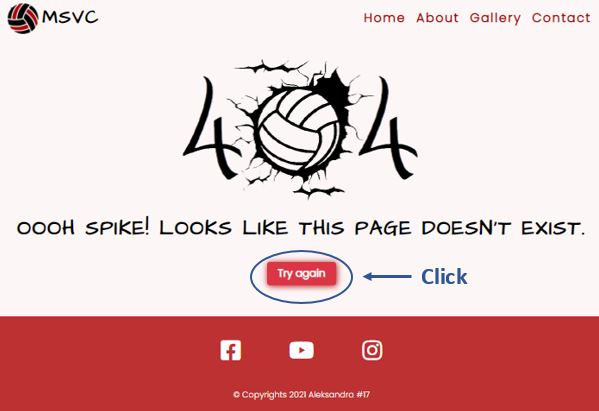

## Bugs

| Bug                                                                                                               | Fix                                                                                                                                       |
| ----------------------------------------------------------------------------------------------------------------- | ----------------------------------------------------------------------------------------------------------------------------------------- |
| Bootstrap framework was overriding my internal CSS rules                                                          | Integrated my CSS stylesheet beneath the external stylesheet links to have higher priority                                                |
| On smaller screen sizes, the carousel caption was covering the whole image making it almost unvisible to the user | I removed the h2 from the second and third slide and set h3 size accordingly to the screen size to stay only at the bottom of the picture |
| The radio buttons were left out on the previous row with the label beneath as screen size got smaller             | Groupped the radio button with label by creating a class with 'white-space: no wrap' property                                             |
| The email address in the info box was overflowing on medium size screens                                          | Changed the grid bootstrap system for email to take up space of 12 rows                                                                   |
| The footer had a small white gap to the bottom                                                                    | Set bottom margin to 0                                                                                                                    |
| Links to the main website on the 404 page did not work                                                            | Fixed with the correct filepath                                                                                                           |
| Wave Validator identified skipped header level in carousel caption                                                | Changed h3 & h4 to h2 & h3                                                                                                                |
| Warning for Quote Section lacking heading (The W3C Markup Validation)                                             | Removed section and replaced with div                                                                                                     |

## Deployment

### GitHub Pages
The website was deployed using GitHub Pages by following these steps:
1. In the GitHub repository navigate to the Settings tab
2. On the left hand menu select Pages
3. For the source select Branch: main
4. Once saved, GitHub will refresh and your website will be publishd from GitHub repository
5. The link to your published website will appear: "Your site is published at https://aleksandracodes.github.io/CI_PP1_MSVC/"

### Forking the GitHub Repository
1. Go to the GitHub repository
2. Click on Fork button in top right corner

### Making a Local Clone
1. Go to the GitHub repository 
2. Locate the Code button above the list of files and click it
3. Highlight the "HTTPS" button to clone with HTTPS and copy the link
4. Open Git Bash
5. Change the current working directory to the one where you want the cloned directory
6. Type git clone and paste the URL from the clipboard ($ git clone https://github.com/YOUR-USERNAME/YOUR-REPOSITORY)
7. Press Enter to create your local clone

## Credits

### Images
[Nav Logo](assets/images/msvc-logo.png): Icon by juicy_fish on [Flaticon](https://www.flaticon.com/premium-icon/volleyball-ball_5140669)

[Social Volleyball Logo](assets/images/socialvolleyball-logo.png) & [Jaguars Logo](assets/images/jaguars-logo.png) provided by Stefano Scrocco (MSVC Head Coach).

[Quote](assets/images/quote-picture.jpg): Photo by [Pexels](https://pixabay.com/users/pexels-2286921/) on [Pixabay](https://pixabay.com/photos/beach-daylight-landscape-light-net-1868379/)

Social Media Icons taken from [Fontawesome](https://fontawesome.com/)

404 error page created in Paint by developer using graphics from [Creative Fabrica](https://www.creativefabrica.com/product/volleyball-ball-cracked-wall/)

The rest of images on the website are owned by the developer.

### Code

- [Navbar with toggler](https://getbootstrap.com/docs/5.1/components/navbar/#toggler) was built using the Bootstrap v5.1.3 documentation
- [Carousel](https://getbootstrap.com/docs/5.1/components/carousel/#with-captions) with captions was built based on the Bootrap v5.1.3 documentation code snippet
- Quote section was inspired by the [Steven Pressfield codepen](https://codepen.io/jupago/pen/dwZKbM)
- Google Maps were embedded using the code on [Google Maps Platform](https://developers.google.com/maps/documentation/embed/get-started)
- 404 page was created based on description on [GitHub Docs](https://docs.github.com/en/pages/getting-started-with-github-pages/creating-a-custom-404-page-for-your-github-pages-site)
- Credit to Code Institute for the formdump used in my Contact Form.

## Acknowledgements
I would like to thank everyone who supported me in the development of the website:
- My mentor Mo Shami for professional guidance and feedback
- Stefano Scrocco, MSVC Head Coach, who provided club's logos, information used in About Section and shared ideas to improve user experience
- My partner for patience with me when code did not work the way I expected
- My friends who tested the website on different devices for responsiveness
