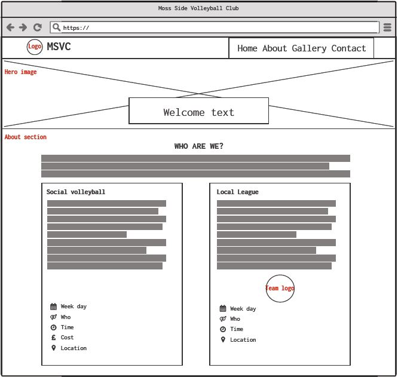
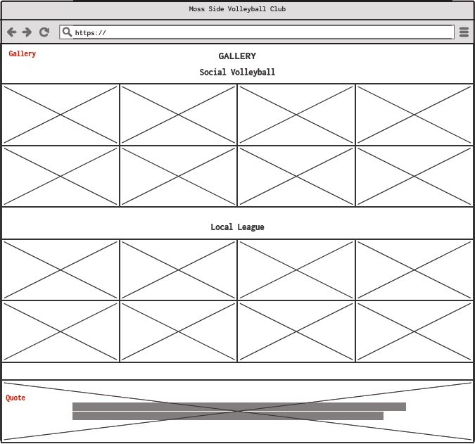
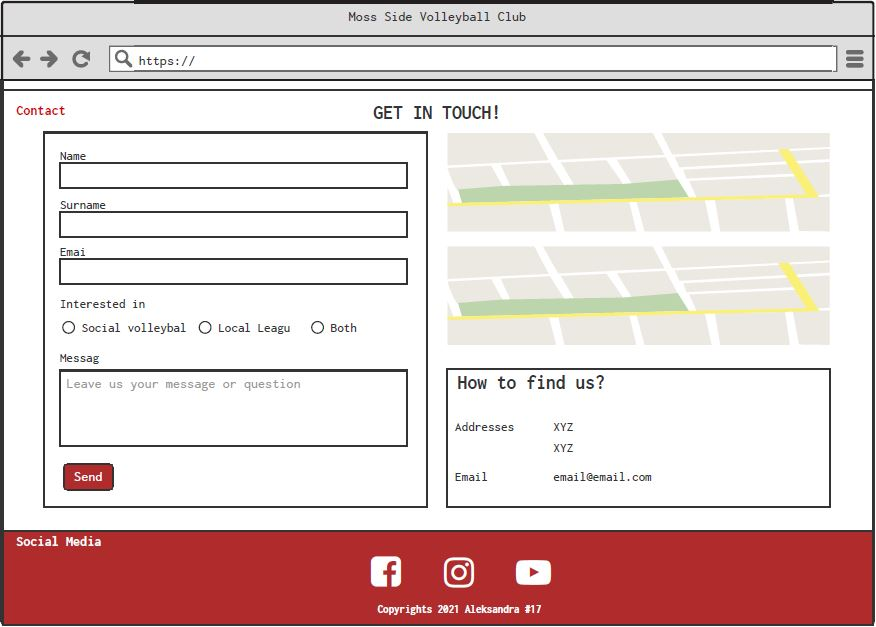
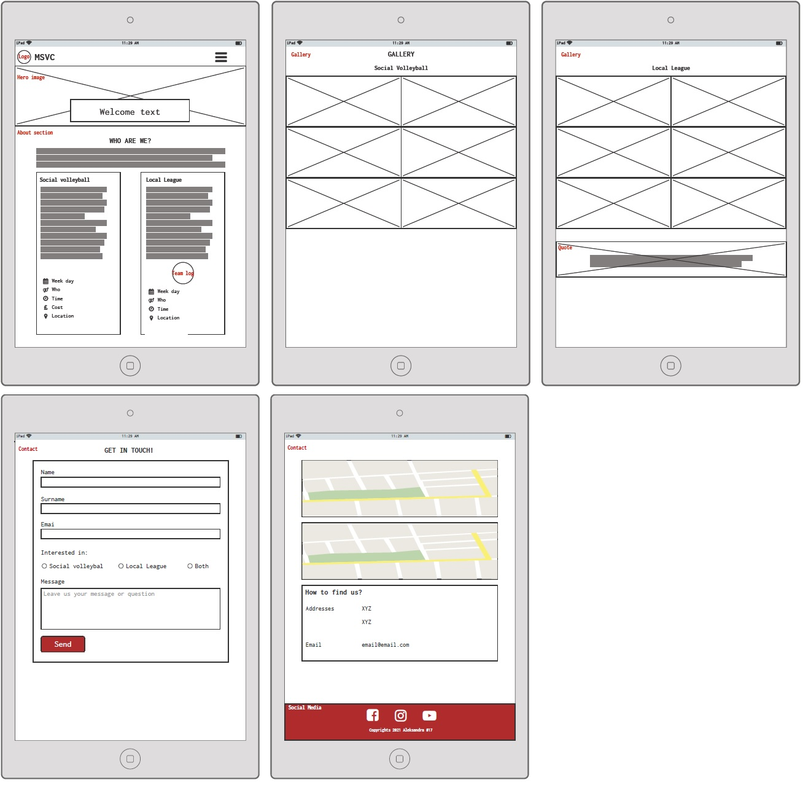
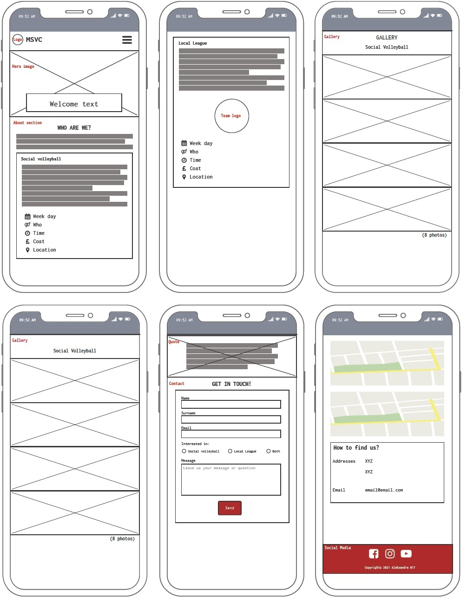
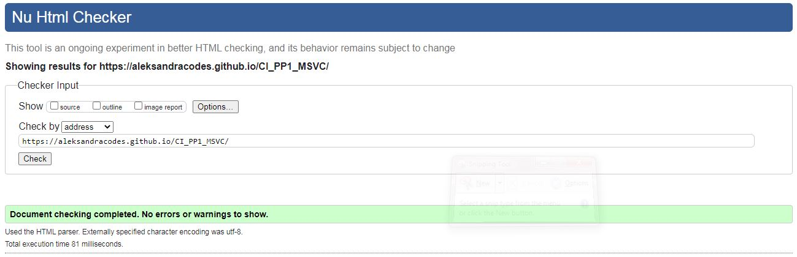
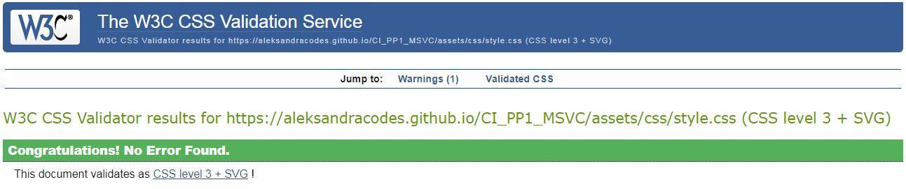

# Moss Side Volleyball Club 

Developer: Aleksandra Haniok

Live webpage
<https://aleksandracodes.github.io/CI_PP1_MSVC/>

## Table of Content

## Project Goals

### User Goals

- Find a local volleyball club that offers training sessions for beginners where you can learn basic volleyball skills
- See the timetable of volleyball sessions
- Find a local team to compete in the volleyball league
- Find the location of sports venues where training sessions take place
- Enquire more information about the trainings and club
- Express interest and joining local community in playing volleyball

### Site Owner Goals

- Promote volleyball in the local area
- Promote the club
- Encourage people to start playing volleyball
- Provide essential information about the training sessions
- Obtain new players to the competitive team

## User Experience

### Target Audience

- People looking to learn to play volleyball
- People looking to come back to volleyball after not playing for a long time
- People willing to find a club which takes part in the local competition

### User Requirements and Expectations

- Quickly and easily find the relevant information
- Simple navigation around website
- Visually appealing design for all screen size
- Links and functions that work as expected
- An easy way to contact the club
- Accessibility

### User Stories

#### First-time users

1. As a first time user, I want to find out more about the club
2. As a first time user, I want to find out if I can join the club if I have never played volleyball before
3. As a first time user, I want to know if the club takes part in the local competition
4. As a first time user, I want to get a feeling of the club
5. As a first time user, I want to be able to contact the club with a specific question
   
#### Returning visitor

6. As a returning user, I want to see pictures from the recent club tournaments
7. As a returning user, I want to know who joins the social sessions
8. As a returning user, I want to find the club on social media
9. As a returning user, I want to know the training sessions times
10. As a returning user, I want to get direction to the sports venues

#### Site Owner

11.	As the site owner, I want user to get to know the club
12.	As the site owner, I want user to be able to contact us
13.	As the site owner, I want users to join the training sessions
14.	As the site owner, I want my site to be responsive
15.	As the site owner, I don’t want users to use browser back button if they’re searching for a page which does not exist.

## Design

### Colour

For the colour scheme a combination of black, dark red and white were chosen to match the club's logos. These colours and their shades were used throughout each section in such a way to ensure the contrast between them was right.

### Fonts

Architects Daughter with cursive as fallback was used for the logo and headings to give a bit of fun and relax feeling of the club.
Poppins with sans-serif as fallback was used for the body to present the content in clear and legible way.

### Structure

The website is structured in a user friendly and easy to learn way. At the top of the page the user can see a recognisable type of navigation bar with the club logo and name on the left side and the navigation links to the right which collapse to hamburger icon on smaller screen sizes. 

The website consists of four sections:

- A landing (home) section with a navigation bar and hero images on a carousel
- An about section with the information about the club
- A gallery with images from social volleyball trainings and local league games giving a general feel of the club
- A contact section with a contact form, location maps of two sports venues and information how to find the club

At the bottom of the page there is a footer with links to social media and copyrights info.

A separate 404 error page was created.

### Wireframes

Big screens - laptop & desktop

Medium screens - tablets

Small screens - mobile

## Technologies Used

### Languages

- HTML
- CSS

### Frameworks & Tools

- Balsamiq
- Bootstrap v5.1.3
- Favicon.io
- Font Awesome
- Git
- GitHub
- Google Fonts
- Pixabay.com
- Remove.bg
- Visual Studio Code

## Features

## Validation

### HTML Validation

The W3C Markup Validation Service was used to validate the HTML of the website. All pages pass with no errors or no warnings to show.

All site

404 error page

### CSS Validation

The W3C Jigsaw CSS Validation Service was used to validate the CSS of the website.
When validating all website, it passes with no errors found. However, some warning are identified linked to Bootstrap v5.1.3. 
When validating my own internal CSS, the validator shows no errors and one warning associated with vendor extension (-webkit-appearance).

All site

Internal stylesheet

## Testing

### Accessibility

### Performance

### Performing tests on various devices

### Browser compatability

### Testing user stories

## Bugs

| Bug | Fix |
| ----------- | ----------- |
| Some bug | The fix for it |
| Paragraph   | Text        |
| Another bug   | How I fixed it |
| Yet another bug | How I fixed them  |

## Deployment

## Credits

## Acknowledgements
